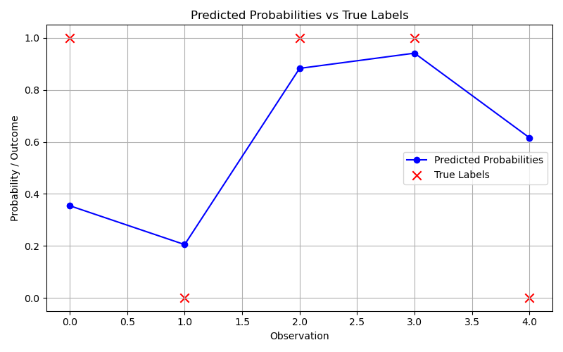

# Logistic-regression-newtonraphson

This project implements logistic regression from scratch using the Newton-Raphson algorithm and compares the results with `statsmodels.Logit`. A custom class-based approach is used to derive and apply the gradient and Hessian, followed by visualization of predicted probabilities vs. actual outcomes.

---

## 📄 Assignment Prompt

- [Assignment PDF – Task4.pdf](./Task4.pdf)

---

## 📌 Project Overview

> This project involves estimating the coefficients of a logit model using a custom implementation of the Newton-Raphson algorithm. It covers the derivation of the log-likelihood, gradient, and Hessian, followed by iterative optimization. The final coefficients are validated using `statsmodels`, and a visual comparison of predicted probabilities and actual labels is provided.

- Implemented logistic regression from scratch using Newton-Raphson  
- Derived and applied:
  - **Log-likelihood**
  - **Gradient**
  - **Hessian matrix**
- Used custom class-based structure in Python
- Compared results with `statsmodels.Logit`  
- Visualized **predicted probabilities vs true labels**

---

## 📊 Key Visualization

---

## Contents

- [Q4.ipynb](./Q4.ipynb) – Newton-Raphson implementation & visualizations  
- 
 – Visualization of predicted probabilities vs actual labels  

---

## Tools Used

- Python 3  
- `numpy`, `matplotlib`, `scipy.optimize`, `statsmodels`

---

## Background

This project was developed during my graduate studies in Data Analytics for Economics and Finance at the University of Glasgow.

---

## Author

Ditep Nantap Rejoice
🔗 [LinkedIn Profile](https://www.linkedin.com/in/nantap-ditep-00490b231)
